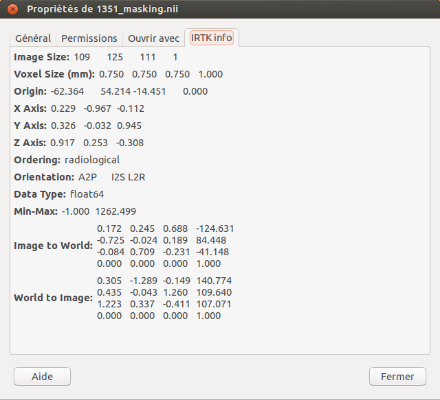

Ubuntu customization for medical imaging
========================================

This github repository accompanies the following blog post:
http://kevin-keraudren.blogspot.co.uk/

Mime-type for *.nii and *.nii.gz
--------------------------------

~/.local/share/mime/packages/nii.xml

Thumbnailer for medical images
------------------------------

/usr/share/thumbnailers/nii.thumbnailer

~/Scripts/nii_thumbnailer.py

Use rview as default viewer in nautilus
---------------------------------------

/usr/share/applications/rview.desktop

Property tab in nautilus for medical images
-------------------------------------------

~/.local/share/nautilus-python/extensions/nautilus-irtk-property-page.py

